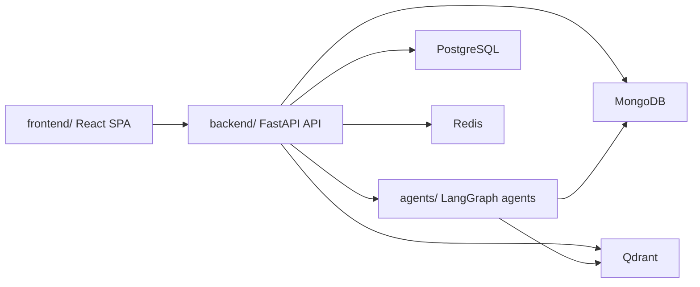

# Vector Agents

Initial monorepo scaffold for the Vector Agents platform. This issue establishes the shared repository layout, local development infrastructure, and CI skeleton that later frontend, backend, and agent work will build on.

## Repository Layout

```text
.
├── agents/
├── backend/
├── docs/
├── frontend/
├── .github/workflows/
├── .env.example
├── docker-compose.yml
├── docker-compose.prod.yml
├── Makefile
└── README.md
```

## Quick Start

1. Copy the example environment file:

   ```bash
   cp .env.example .env
   ```

2. Start the local infrastructure:

   ```bash
   make up
   ```

3. Confirm service health:

   ```bash
   docker compose ps
   ```

4. Stop the stack when finished:

   ```bash
   make down
   ```

## Frontend App

The frontend scaffold now lives in [frontend/package.json](/Users/devinda/VS/Veracity/frontend/package.json) and can be started independently:

```bash
cd frontend
npm install
npm run dev
```

## Backend App

The FastAPI backend scaffold now lives in [backend/main.py](/Users/devinda/VS/Veracity/backend/main.py) and can be started independently:

```bash
cd backend
python3 -m venv .venv
. .venv/bin/activate
pip install -r requirements.txt
uvicorn main:app --reload --host 0.0.0.0 --port 8000
```

### Local Service Endpoints

- MongoDB: `mongodb://localhost:27017`
- PostgreSQL: `postgresql://localhost:5432`
- Redis: `redis://localhost:6379`
- Qdrant API: `http://localhost:6333`
- Qdrant gRPC: `http://localhost:6334`

## Environment Variables

The base infrastructure expects the variables documented in [`.env.example`](/Users/devinda/VS/Veracity/.env.example). The important application-facing values are:

- `MONGO_URI`
- `DATABASE_URL`
- `QDRANT_URL`
- `REDIS_URL`
- `JWT_SECRET`
- `OPENAI_API_KEY`

## Architecture



## Notes

- `frontend/`, `backend/`, and `agents/` currently contain placeholders and are intentionally ready for the next milestone issues.
- `docker-compose.prod.yml` is a minimal production override placeholder for later hardening work.
- `.github/workflows/ci.yml` is a non-blocking skeleton until real lint and test commands exist.
