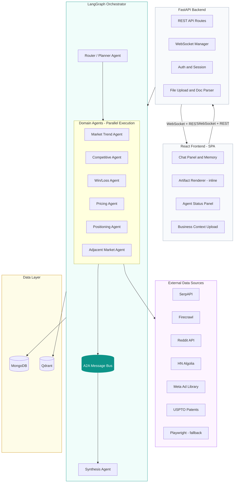
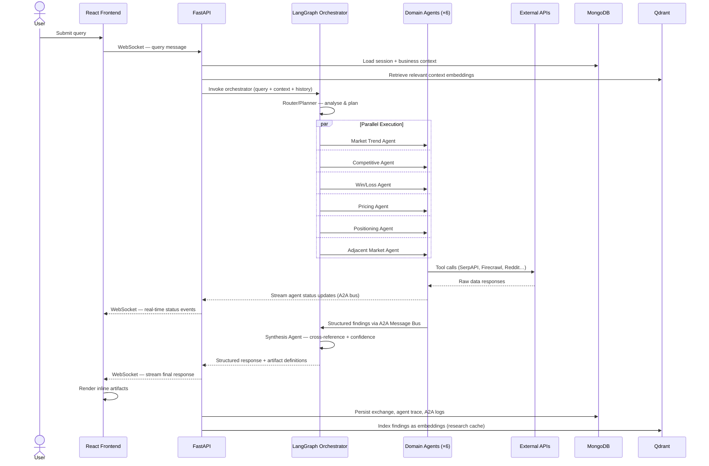
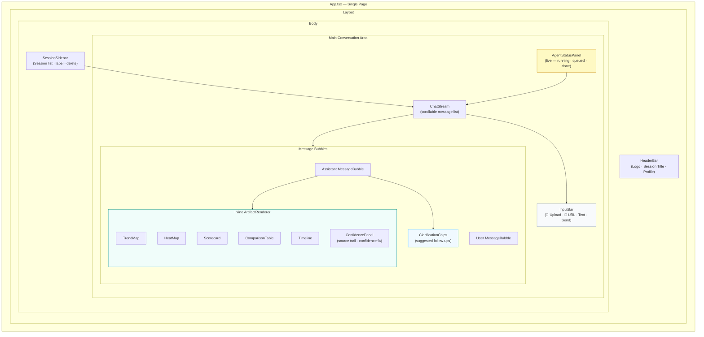
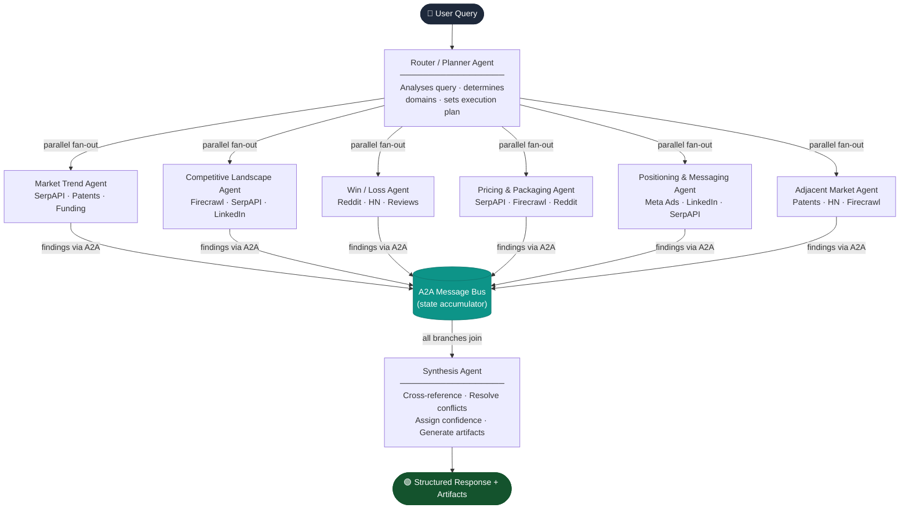
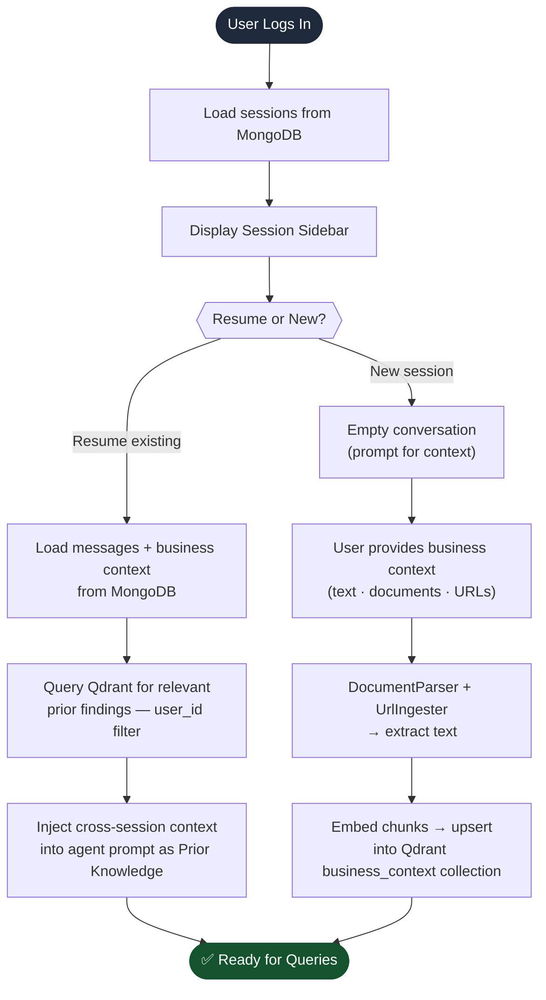
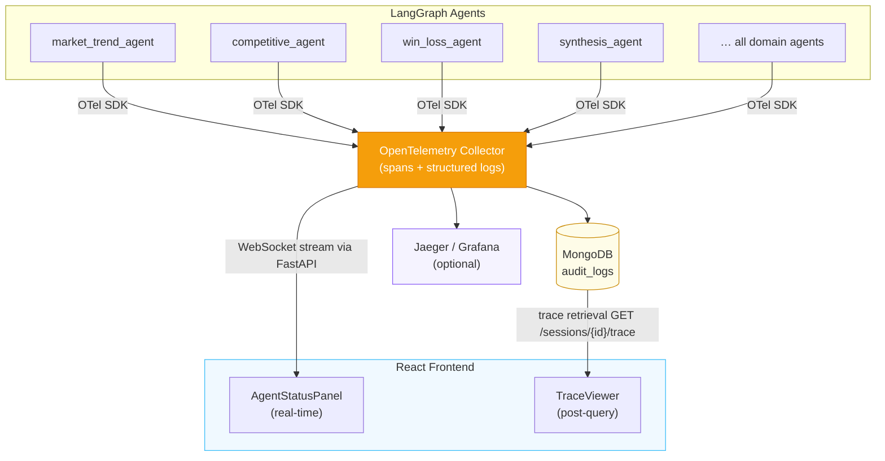
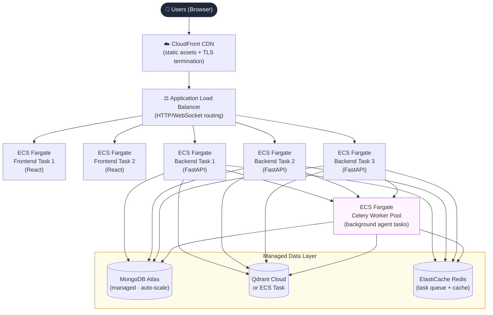

# System Design Document

## Vector Agents — AI-Powered Growth Intelligence Platform

**Document Version:** 1.0
**Date:** March 15, 2026
**Prepared by:** Devinda, Torch Labs
**Companion document:** Vector_Agents_SRS.md (v1.1)

---

## Table of Contents

1. [Introduction](#1-introduction)
2. [High-Level Architecture](#2-high-level-architecture)
3. [Technology Stack](#3-technology-stack)
4. [Frontend Design — React](#4-frontend-design--react)
5. [Backend Design — FastAPI](#5-backend-design--fastapi)
6. [Multi-Agent Orchestration — LangGraph](#6-multi-agent-orchestration--langgraph)
7. [A2A Inter-Agent Protocol](#7-a2a-inter-agent-protocol)
8. [Data Layer — MongoDB](#8-data-layer--mongodb)
9. [Vector Store — Qdrant](#9-vector-store--qdrant)
10. [External Data Source Integration](#10-external-data-source-integration)
11. [Authentication & Session Management](#11-authentication--session-management)
12. [Observability & Logging](#12-observability--logging)
13. [Deployment Architecture](#13-deployment-architecture)
14. [Security Design](#14-security-design)
15. [Performance & Scalability](#15-performance--scalability)
16. [Error Handling & Robustness](#16-error-handling--robustness)
17. [Cost Estimation Model](#17-cost-estimation-model)
18. [Project Structure](#18-project-structure)

---

## 1. Introduction

### 1.1 Purpose

This document translates the requirements defined in the Vector Agents SRS (v1.1) into a concrete system design. It specifies the architecture, component design, data models, integration patterns, and deployment strategy using the following technology stack: **React**, **FastAPI**, **LangGraph**, **MongoDB**, and **Qdrant**.

### 1.2 Architectural Goals

The design must satisfy these non-negotiable properties derived from the SRS:

1. **Not a chatbot** — dynamic inline artifacts, not plain text. (AR-01)
2. **Not one model call** — genuine multi-agent orchestration with parallelism. (AR-02)
3. **Live signal only** — every claim grounded in real-time data with source trails. (AR-03)
4. **Single-page conversational interface** — no dashboards, no navigation. (FR-5.1.1)
5. **Personalised intelligence** — business context (text, docs, URLs) persisted within and across sessions. (FR-4.7.4–4.7.5)
6. **A2A protocol** — all inter-agent communication via a standardised message bus. (FR-4.8.1–4.8.5)
7. **Full observability** — structured logs, distributed traces, real-time status. (NFR-6.6.1–6.6.6)

### 1.3 Scope

This document covers the full system: frontend SPA, backend API, agent orchestration layer, data storage, vector search, external integrations, deployment, and observability. It does not cover marketing, sales, or non-engineering operational processes.

---

## 2. High-Level Architecture

### 2.1 Architecture Overview



### 2.2 Data Flow — Query Lifecycle



A single user query follows this path:

1. **User submits query** via React chat input → WebSocket message to FastAPI.
2. **FastAPI receives** the message, authenticates the session, loads business context from MongoDB, and retrieves relevant embeddings from Qdrant.
3. **FastAPI invokes LangGraph** orchestrator with the query, business context, conversation history, and retrieved context.
4. **LangGraph Router/Planner Agent** analyses the query and determines which domain agents to invoke and whether they can run in parallel.
5. **Domain agents execute in parallel** — each agent makes tool calls (Firecrawl, SerpAPI, Reddit API, etc.), processes results, and emits structured findings via the A2A message bus.
6. **Agent status updates** are streamed back to the frontend via WebSocket in real-time (NFR-6.6.3).
7. **Synthesis Agent** collects all parallel findings, cross-references, resolves conflicts, assigns confidence scores, and produces a unified structured response.
8. **FastAPI formats** the response with artifact type hints and streams it to the frontend.
9. **React renders** the response as inline interactive artifacts (charts, scorecards, heat maps) within the conversation stream.
10. **MongoDB stores** the complete exchange (messages, agent traces, A2A logs, findings) for session persistence and cross-session memory.
11. **Qdrant indexes** key findings as embeddings for future semantic retrieval.

---

## 3. Technology Stack

| Layer | Technology | Role |
|---|---|---|
| Frontend | **React 18+** (with TypeScript) | Single-page conversational interface, inline artifact rendering, WebSocket client |
| UI Components | **Tailwind CSS** + **Recharts** / **D3.js** | Styling, charts, heat maps, interactive visualisations |
| Backend API | **FastAPI** (Python 3.11+) | REST + WebSocket API, session management, file upload, orchestrator bridge |
| Agent Orchestration | **LangGraph** | Multi-agent state graphs, parallel execution, tool integration, A2A messaging |
| LLM Provider | **Anthropic Claude** (via API) | Agent reasoning, synthesis, natural language generation |
| Primary Database | **MongoDB 7+** | Sessions, chat history, user profiles, audit trails, A2A message logs |
| Vector Database | **Qdrant** | Semantic search over business context, research cache, cross-session knowledge |
| Web Scraping | **Firecrawl** (primary) / **Playwright** (fallback) | Page-to-markdown conversion, JS-heavy site scraping |
| Search APIs | **SerpAPI**, **Reddit API**, **HN Algolia**, **Meta Ad Library** | Structured live-data retrieval |
| Task Queue | **Celery** + **Redis** | Background agent execution, rate-limit management |
| Observability | **OpenTelemetry** + **Structured JSON Logging** | Distributed traces, structured logs, spans |
| Containerisation | **Docker** + **Docker Compose** | Local dev and production deployment |
| Cloud Deploy | **AWS** (ECS / EKS) or **GCP** (Cloud Run / GKE) | Horizontal scaling, managed infrastructure |

---

## 4. Frontend Design — React

### 4.1 Application Shell

The frontend is a single-page application with zero navigation routes. The entire UI is one view: a conversation stream with an input bar and contextual panels.



### 4.2 Component Architecture

```
src/
├── app/
│   └── App.tsx                      # Root component, WebSocket provider
├── components/
│   ├── chat/
│   │   ├── ChatStream.tsx           # Scrollable message list
│   │   ├── MessageBubble.tsx        # Single message (user or system)
│   │   ├── InputBar.tsx             # Text input + file upload + URL input
│   │   └── ClarificationChips.tsx   # Suggested follow-up chips
│   ├── artifacts/
│   │   ├── ArtifactRenderer.tsx     # Dispatcher — routes artifact_type to component
│   │   ├── TrendMap.tsx             # Recharts-based trend timeline
│   │   ├── HeatMap.tsx              # D3 or Recharts heat matrix
│   │   ├── Scorecard.tsx            # Weighted comparison table
│   │   ├── ComparisonTable.tsx      # Side-by-side feature table
│   │   ├── Timeline.tsx             # Chronological event view
│   │   └── ConfidencePanel.tsx      # Per-finding evidence breakdown
│   ├── agents/
│   │   ├── AgentStatusPanel.tsx     # Real-time agent activity indicators
│   │   └── TraceViewer.tsx          # Post-query agent trace expansion
│   ├── context/
│   │   ├── BusinessContextPanel.tsx # Business info display & management
│   │   └── FileUploader.tsx         # Document upload (PDF/DOCX/TXT)
│   └── session/
│       ├── SessionSidebar.tsx       # Session list (label, resume, delete)
│       └── SessionHeader.tsx        # Current session title & controls
├── hooks/
│   ├── useWebSocket.ts             # WebSocket connection & message handling
│   ├── useChat.ts                  # Chat state management
│   ├── useAgentStatus.ts           # Real-time agent status tracking
│   └── useSession.ts              # Session CRUD operations
├── stores/
│   └── chatStore.ts                # Zustand store for global chat state
├── types/
│   ├── message.ts                  # Message, Artifact, Finding types
│   ├── agent.ts                    # AgentStatus, TraceSpan types
│   └── session.ts                 # Session, BusinessContext types
└── utils/
    ├── artifactParser.ts           # Parse structured response → artifact props
    └── confidenceColor.ts          # Map confidence score → colour badge
```

### 4.3 Key Frontend Patterns

**WebSocket-first communication.** All query submissions and agent status updates flow over a persistent WebSocket connection. REST endpoints are used only for session CRUD, file upload, and authentication.

**Artifact Renderer dispatch.** The backend returns each finding with an `artifact_type` field (e.g., `"scorecard"`, `"heat_map"`, `"trend_map"`). The `ArtifactRenderer` component dispatches to the correct visualisation component based on this type tag. Artifacts are never links — they render inline as React components.

**Streaming responses.** As the LangGraph orchestrator produces partial results (agent status changes, individual findings from parallel agents), they are streamed to the frontend via WebSocket and progressively rendered. The user sees results appear as agents complete, not all-at-once.

**Confidence indicators.** Every artifact component receives a `confidence` prop (0–100) and renders a colour-coded badge: green (≥75), amber (50–74), red (<50). The `ConfidencePanel` is expandable to show per-claim source trails.

### 4.4 State Management

```typescript
// Zustand store — chatStore.ts
interface ChatState {
  sessions: Session[];
  activeSessionId: string | null;
  messages: Message[];
  agentStatuses: Record<string, AgentStatus>;
  businessContext: BusinessContext | null;
  isStreaming: boolean;

  // Actions
  sendQuery: (text: string) => void;
  uploadDocument: (file: File) => void;
  addUrl: (url: string) => void;
  switchSession: (sessionId: string) => void;
  createSession: () => void;
  deleteSession: (sessionId: string) => void;
}
```

### 4.5 Core TypeScript Types

```typescript
// types/message.ts
interface Message {
  id: string;
  session_id: string;
  role: "user" | "assistant";
  content: string;                    // Markdown text portion
  artifacts: Artifact[];              // Inline rendered components
  clarification_chips: string[];      // Suggested follow-ups
  timestamp: string;
}

interface Artifact {
  artifact_type: "trend_map" | "heat_map" | "scorecard"
    | "comparison_table" | "timeline" | "confidence_panel";
  title: string;
  data: Record<string, any>;         // Typed payload per artifact type
  confidence: number;                 // 0–100
  sources: SourceReference[];
}

interface SourceReference {
  title: string;
  url: string;
  retrieved_at: string;
  source_type: string;               // e.g., "serpapi", "reddit", "firecrawl"
}

// types/agent.ts
interface AgentStatus {
  agent_id: string;
  agent_name: string;                // e.g., "Market Trend Agent"
  status: "queued" | "running" | "completed" | "failed";
  current_task: string;              // e.g., "Scanning job boards..."
  elapsed_ms: number;
  findings_count: number;
}

interface TraceSpan {
  span_id: string;
  parent_span_id: string | null;
  agent_id: string;
  action: string;
  tool_calls: ToolCallRecord[];
  start_time: string;
  end_time: string;
  status: "ok" | "error";
}
```

---

## 5. Backend Design — FastAPI

### 5.1 Application Structure

```
backend/
├── main.py                          # FastAPI app factory, lifespan events
├── config.py                        # Pydantic Settings (env vars, API keys)
├── api/
│   ├── routes/
│   │   ├── chat.py                  # POST /chat, WebSocket /ws/chat
│   │   ├── sessions.py             # CRUD /sessions
│   │   ├── upload.py               # POST /upload (document + URL ingestion)
│   │   ├── auth.py                 # POST /auth/login, /auth/register
│   │   └── health.py              # GET /health
│   ├── websocket/
│   │   └── manager.py              # WebSocket connection manager
│   └── middleware/
│       ├── auth.py                 # JWT verification middleware
│       └── rate_limit.py           # Per-user rate limiting
├── services/
│   ├── orchestrator.py             # LangGraph invocation bridge
│   ├── document_parser.py          # PDF/DOCX/TXT → text extraction
│   ├── url_ingester.py             # Firecrawl / Playwright URL → markdown
│   ├── embedding_service.py        # Text → embeddings via LLM API
│   ├── session_service.py          # Session CRUD + cross-session memory
│   └── observability.py           # Trace + log emission
├── models/
│   ├── schemas.py                  # Pydantic request/response models
│   ├── db_models.py               # MongoDB document models (ODM)
│   └── a2a.py                     # A2A message schema
├── agents/                         # LangGraph agent definitions
│   ├── graph.py                    # Main orchestration graph
│   ├── router_agent.py            # Query analysis + agent routing
│   ├── market_trend_agent.py      # Domain: Market & Trend Sensing
│   ├── competitive_agent.py       # Domain: Competitive Landscape
│   ├── win_loss_agent.py          # Domain: Win / Loss Intelligence
│   ├── pricing_agent.py          # Domain: Pricing & Packaging
│   ├── positioning_agent.py       # Domain: Positioning & Messaging
│   ├── adjacent_market_agent.py   # Domain: Adjacent Market Collision
│   └── synthesis_agent.py         # Cross-agent result synthesis
├── tools/                          # LangGraph tool definitions
│   ├── firecrawl_tool.py          # Firecrawl MCP / API wrapper
│   ├── serpapi_tool.py            # SerpAPI wrapper
│   ├── reddit_tool.py            # Reddit API wrapper
│   ├── hn_tool.py                # HN Algolia wrapper
│   ├── meta_ads_tool.py          # Meta Ad Library wrapper
│   ├── linkedin_tool.py          # LinkedIn Ad Library scraper
│   ├── patents_tool.py           # USPTO patent search
│   └── playwright_tool.py        # Playwright fallback scraper
├── db/
│   ├── mongodb.py                 # MongoDB client + connection pool
│   └── qdrant.py                 # Qdrant client + collection management
└── tests/
    ├── test_api/
    ├── test_agents/
    └── test_tools/
```

### 5.2 API Endpoints

#### REST Endpoints

| Method | Path | Description | Auth | SRS Ref |
|---|---|---|---|---|
| POST | `/api/v1/auth/register` | Create user account | No | NFR-6.5 |
| POST | `/api/v1/auth/login` | Authenticate, return JWT | No | NFR-6.5 |
| GET | `/api/v1/sessions` | List user's sessions (with labels) | Yes | FR-4.7.6 |
| POST | `/api/v1/sessions` | Create new session | Yes | FR-4.7.5 |
| GET | `/api/v1/sessions/{id}` | Get session with full history | Yes | FR-4.7.5 |
| PATCH | `/api/v1/sessions/{id}` | Rename / label session | Yes | FR-4.7.6 |
| DELETE | `/api/v1/sessions/{id}` | Delete session and its data | Yes | FR-4.7.6 |
| POST | `/api/v1/sessions/{id}/context` | Upload business context (file or URL) | Yes | FR-5.1.7, FR-5.1.8 |
| GET | `/api/v1/sessions/{id}/trace` | Get agent trace for a query | Yes | NFR-6.6.4 |
| GET | `/api/v1/health` | Health check | No | — |

#### WebSocket Endpoint

| Path | Description |
|---|---|
| `ws://host/ws/chat/{session_id}` | Bi-directional streaming for chat queries, agent status updates, and progressive artifact delivery |

### 5.3 WebSocket Message Protocol

All WebSocket messages are JSON with a `type` field for routing.

**Client → Server:**

```json
{
  "type": "query",
  "payload": {
    "text": "Is Lilian competitive in the AI SDR market?",
    "session_id": "sess_abc123"
  }
}
```

**Server → Client (Agent Status):**

```json
{
  "type": "agent_status",
  "payload": {
    "agent_id": "market_trend_01",
    "agent_name": "Market Trend Agent",
    "status": "running",
    "current_task": "Scanning Google Trends for AI SDR keywords...",
    "elapsed_ms": 3200
  }
}
```

**Server → Client (Partial Finding):**

```json
{
  "type": "partial_finding",
  "payload": {
    "agent_id": "competitive_01",
    "finding": {
      "domain": "competitive_landscape",
      "summary": "Lilian AI has raised $12M Series A...",
      "confidence": 92,
      "is_fact": true,
      "sources": [{"title": "TechCrunch", "url": "https://..."}]
    }
  }
}
```

**Server → Client (Final Response):**

```json
{
  "type": "response",
  "payload": {
    "message_id": "msg_xyz",
    "content": "Based on analysis across 6 domains...",
    "artifacts": [
      {
        "artifact_type": "scorecard",
        "title": "AI SDR Competitive Scorecard",
        "data": { "rows": [...], "columns": [...] },
        "confidence": 85,
        "sources": [...]
      }
    ],
    "clarification_chips": [
      "Deep-dive into Lilian's pricing model",
      "Show adjacent market threats"
    ],
    "trace_id": "trace_abc"
  }
}
```

### 5.4 Document Parsing Service

```python
# services/document_parser.py

class DocumentParser:
    """Extracts text from uploaded business context documents."""

    async def parse(self, file: UploadFile) -> ParsedDocument:
        ext = Path(file.filename).suffix.lower()
        if ext == ".pdf":
            return await self._parse_pdf(file)
        elif ext == ".docx":
            return await self._parse_docx(file)
        elif ext == ".txt":
            return await self._parse_txt(file)
        else:
            raise UnsupportedFileType(ext)

    async def _parse_pdf(self, file) -> ParsedDocument:
        # Uses pymupdf (fitz) for text extraction
        ...

    async def _parse_docx(self, file) -> ParsedDocument:
        # Uses python-docx for paragraph + table extraction
        ...

    async def _parse_txt(self, file) -> ParsedDocument:
        # Direct UTF-8 read
        ...
```

### 5.5 URL Ingestion Service

```python
# services/url_ingester.py

class UrlIngester:
    """Crawls user-provided URLs and converts to LLM-ready text."""

    def __init__(self, firecrawl_client, playwright_runner):
        self.firecrawl = firecrawl_client
        self.playwright = playwright_runner

    async def ingest(self, url: str) -> IngestedPage:
        try:
            # Primary: Firecrawl (fast, structured markdown)
            result = await self.firecrawl.scrape(url, formats=["markdown"])
            return IngestedPage(url=url, content=result.markdown, method="firecrawl")
        except FirecrawlError:
            # Fallback: Playwright (JS-heavy or blocked pages)
            result = await self.playwright.scrape(url)
            return IngestedPage(url=url, content=result.text, method="playwright")
```

---

## 6. Multi-Agent Orchestration — LangGraph

### 6.1 Why LangGraph

LangGraph provides stateful, graph-based agent orchestration with built-in support for parallel branch execution, conditional routing, checkpointing, and tool integration. It maps directly to the SRS requirements for multi-agent coordination (FR-5.2.1–5.2.5), parallel execution (FR-4.3.1), and lifecycle management (FR-4.5.1–4.5.4).

### 6.2 Agent Graph Topology



### 6.3 LangGraph State Schema

```python
# agents/graph.py

from langgraph.graph import StateGraph, START, END
from typing import TypedDict, Annotated
import operator

class AgentFinding(TypedDict):
    domain: str                        # Which intelligence domain
    summary: str                       # Human-readable finding
    evidence: list[dict]               # Raw evidence items
    sources: list[dict]                # Source references
    confidence: float                  # 0.0 – 1.0
    is_fact: bool                      # Fact vs interpretation flag
    agent_id: str                      # Which agent produced this

class OrchestratorState(TypedDict):
    # Input
    query: str                         # User's natural language query
    business_context: str              # Assembled business context text
    business_context_embeddings: list  # Pre-computed Qdrant results
    conversation_history: list[dict]   # Prior messages in session
    session_id: str

    # Routing
    active_domains: list[str]          # Which domains the router activated
    execution_plan: dict               # Parallel / sequential plan

    # Agent outputs (accumulated via reducer)
    findings: Annotated[list[AgentFinding], operator.add]

    # A2A message log
    a2a_messages: Annotated[list[dict], operator.add]

    # Synthesis output
    synthesised_response: dict | None  # Final structured response
    artifacts: list[dict]              # Artifact definitions for frontend
    clarification_chips: list[str]     # Suggested follow-ups

    # Observability
    trace_spans: Annotated[list[dict], operator.add]
```

### 6.4 Graph Construction

```python
# agents/graph.py

def build_orchestrator_graph() -> StateGraph:
    graph = StateGraph(OrchestratorState)

    # Add nodes
    graph.add_node("router", router_agent)
    graph.add_node("market_trend", market_trend_agent)
    graph.add_node("competitive", competitive_agent)
    graph.add_node("win_loss", win_loss_agent)
    graph.add_node("pricing", pricing_agent)
    graph.add_node("positioning", positioning_agent)
    graph.add_node("adjacent_market", adjacent_market_agent)
    graph.add_node("synthesis", synthesis_agent)

    # Router → parallel domain agents (conditional fan-out)
    graph.add_edge(START, "router")

    graph.add_conditional_edges(
        "router",
        route_to_domains,          # Returns list of active domain nodes
        {
            "market_trend": "market_trend",
            "competitive": "competitive",
            "win_loss": "win_loss",
            "pricing": "pricing",
            "positioning": "positioning",
            "adjacent_market": "adjacent_market",
        }
    )

    # All domain agents → synthesis (fan-in)
    for domain_node in [
        "market_trend", "competitive", "win_loss",
        "pricing", "positioning", "adjacent_market"
    ]:
        graph.add_edge(domain_node, "synthesis")

    graph.add_edge("synthesis", END)

    return graph.compile()


def route_to_domains(state: OrchestratorState) -> list[str]:
    """Router agent determines which domains to activate."""
    return state["active_domains"]
```

### 6.5 Domain Agent Template

Each domain agent follows the same structural pattern, with specialised tools and prompts.

```python
# agents/market_trend_agent.py

from langchain_core.tools import tool
from agents.a2a import emit_a2a_message

async def market_trend_agent(state: OrchestratorState) -> dict:
    agent_id = "market_trend_01"
    span = start_trace_span(agent_id, "market_trend_analysis")

    try:
        # 1. Emit A2A "task_started" message
        emit_a2a_message(state, sender=agent_id, task_type="market_scan")

        # 2. Parallel tool calls
        trends_task = serpapi_google_trends(state["query"], state["business_context"])
        jobs_task = serpapi_job_search(state["business_context"])
        patents_task = uspto_patent_search(state["business_context"])
        funding_task = firecrawl_funding_news(state["business_context"])

        trends, jobs, patents, funding = await asyncio.gather(
            trends_task, jobs_task, patents_task, funding_task
        )

        # 3. LLM synthesis of raw signals into structured findings
        findings = await llm_synthesise_market_trends(
            trends=trends, jobs=jobs, patents=patents,
            funding=funding, business_context=state["business_context"]
        )

        # 4. Emit A2A "task_completed" message
        emit_a2a_message(state, sender=agent_id, task_type="market_scan_complete",
                         payload={"findings_count": len(findings)})

        span.finish(status="ok")
        return {
            "findings": findings,
            "a2a_messages": state.get("a2a_messages", []),
            "trace_spans": [span.to_dict()]
        }

    except Exception as e:
        span.finish(status="error", error=str(e))
        emit_a2a_message(state, sender=agent_id, task_type="task_failed",
                         payload={"error": str(e)})
        return {
            "findings": [AgentFinding(
                domain="market_trend", summary=f"Market Trend Agent failed: {e}",
                evidence=[], sources=[], confidence=0.0,
                is_fact=False, agent_id=agent_id
            )],
            "trace_spans": [span.to_dict()]
        }
```

### 6.6 Synthesis Agent

```python
# agents/synthesis_agent.py

async def synthesis_agent(state: OrchestratorState) -> dict:
    """
    Combines findings from all domain agents into a unified response.
    Cross-references claims, resolves conflicts, assigns final confidence
    scores, and determines artifact types for frontend rendering.
    """
    findings = state["findings"]

    # 1. Group findings by domain
    by_domain = group_findings_by_domain(findings)

    # 2. Cross-reference: find corroborating or conflicting claims
    cross_refs = cross_reference_findings(findings)

    # 3. LLM-driven synthesis
    synthesis_prompt = build_synthesis_prompt(
        query=state["query"],
        business_context=state["business_context"],
        grouped_findings=by_domain,
        cross_references=cross_refs,
        conversation_history=state["conversation_history"]
    )

    response = await llm.ainvoke(synthesis_prompt)

    # 4. Parse structured response → artifacts
    parsed = parse_synthesis_response(response)

    return {
        "synthesised_response": parsed.narrative,
        "artifacts": parsed.artifacts,        # Typed for frontend rendering
        "clarification_chips": parsed.suggested_followups
    }
```

### 6.7 Tool Integration

Each external data source is wrapped as a LangGraph-compatible tool:

```python
# tools/firecrawl_tool.py

from langchain_core.tools import tool

@tool
async def firecrawl_scrape(url: str) -> str:
    """Scrape a webpage and return LLM-ready markdown content."""
    client = FirecrawlClient(api_key=settings.FIRECRAWL_API_KEY)
    result = await client.scrape(url, formats=["markdown"])
    return result.markdown

@tool
async def firecrawl_search(query: str, num_results: int = 5) -> list[dict]:
    """Search the web and return structured results."""
    client = FirecrawlClient(api_key=settings.FIRECRAWL_API_KEY)
    results = await client.search(query, limit=num_results)
    return [{"title": r.title, "url": r.url, "content": r.markdown}
            for r in results]
```

---

## 7. A2A Inter-Agent Protocol

### 7.1 Message Schema

```python
# models/a2a.py

from pydantic import BaseModel
from datetime import datetime
from enum import Enum

class A2ATaskType(str, Enum):
    TASK_STARTED = "task_started"
    TASK_COMPLETED = "task_completed"
    TASK_FAILED = "task_failed"
    FINDING_EMITTED = "finding_emitted"
    CONTEXT_REQUEST = "context_request"
    CONTEXT_RESPONSE = "context_response"
    BROADCAST_QUERY = "broadcast_query"

class A2APriority(str, Enum):
    LOW = "low"
    NORMAL = "normal"
    HIGH = "high"
    CRITICAL = "critical"

class A2AMessage(BaseModel):
    message_id: str                    # UUID
    sender_id: str                     # Agent ID
    receiver_id: str | None            # None = broadcast
    task_type: A2ATaskType
    payload: dict                      # Typed per task_type
    priority: A2APriority = A2APriority.NORMAL
    timestamp: datetime
    trace_id: str                      # Links to distributed trace
    session_id: str
```

### 7.2 Message Bus Implementation

In LangGraph, the A2A message bus is implemented as a state accumulator. Messages are appended to the shared `a2a_messages` list in the graph state, and the orchestrator can inspect them for routing decisions.

```python
# agents/a2a.py

import uuid
from datetime import datetime, timezone

def emit_a2a_message(
    state: dict,
    sender: str,
    task_type: str,
    payload: dict | None = None,
    receiver: str | None = None,
    priority: str = "normal"
) -> dict:
    msg = {
        "message_id": str(uuid.uuid4()),
        "sender_id": sender,
        "receiver_id": receiver,
        "task_type": task_type,
        "payload": payload or {},
        "priority": priority,
        "timestamp": datetime.now(timezone.utc).isoformat(),
        "trace_id": state.get("trace_id", "unknown"),
        "session_id": state.get("session_id", "unknown")
    }

    # Schema validation
    A2AMessage(**msg)  # Raises ValidationError if malformed (FR-4.8.5)

    state.setdefault("a2a_messages", []).append(msg)
    return msg
```

### 7.3 Interaction Patterns

| Pattern | LangGraph Implementation | SRS Ref |
|---|---|---|
| **Request / Response** | Agent A emits a `context_request`; Agent B checks incoming messages and emits `context_response`. Mediated by a conditional edge in the graph. | FR-4.8.3 |
| **Broadcast** | The Router Agent emits `broadcast_query` with `receiver_id: None`. All active domain agents receive the full state including this message. | FR-4.8.3 |
| **Publish / Subscribe** | An agent emits `finding_emitted`; downstream agents (e.g., Synthesis) consume all such messages from the accumulated state. | FR-4.8.3 |

---

## 8. Data Layer — MongoDB

### 8.1 Database Design

MongoDB is used for all structured, non-vector data: user accounts, sessions, chat history, audit trails, A2A logs, and agent run records.

**Database name:** `vector_agents`

### 8.2 Collection Schemas

#### `users`

```json
{
  "_id": "ObjectId",
  "email": "string (unique, indexed)",
  "password_hash": "string",
  "display_name": "string",
  "created_at": "datetime",
  "last_login_at": "datetime",
  "settings": {
    "cross_session_memory_enabled": "boolean (default: true)"
  }
}
```

#### `sessions`

```json
{
  "_id": "ObjectId",
  "user_id": "ObjectId (indexed)",
  "label": "string | null",
  "created_at": "datetime",
  "updated_at": "datetime",
  "business_context": {
    "free_text": "string | null",
    "documents": [
      {
        "filename": "string",
        "parsed_text": "string",
        "uploaded_at": "datetime"
      }
    ],
    "urls": [
      {
        "url": "string",
        "parsed_text": "string",
        "ingested_at": "datetime",
        "method": "firecrawl | playwright"
      }
    ]
  },
  "is_active": "boolean"
}
```

#### `messages`

```json
{
  "_id": "ObjectId",
  "session_id": "ObjectId (indexed)",
  "role": "user | assistant",
  "content": "string",
  "artifacts": [
    {
      "artifact_type": "string",
      "title": "string",
      "data": "object",
      "confidence": "number",
      "sources": ["SourceReference"]
    }
  ],
  "clarification_chips": ["string"],
  "timestamp": "datetime (indexed)",
  "trace_id": "string | null"
}
```

#### `agent_runs`

```json
{
  "_id": "ObjectId",
  "session_id": "ObjectId (indexed)",
  "message_id": "ObjectId",
  "trace_id": "string (indexed)",
  "query": "string",
  "agents_invoked": ["string"],
  "findings": ["AgentFinding"],
  "a2a_messages": ["A2AMessage"],
  "trace_spans": ["TraceSpan"],
  "total_duration_ms": "number",
  "total_llm_tokens": "number",
  "estimated_cost_usd": "number",
  "created_at": "datetime"
}
```

#### `audit_logs`

```json
{
  "_id": "ObjectId",
  "session_id": "ObjectId (indexed)",
  "agent_id": "string (indexed)",
  "action_type": "string",
  "input_summary": "string",
  "output_summary": "string",
  "duration_ms": "number",
  "status": "ok | error",
  "error_detail": "string | null",
  "timestamp": "datetime (indexed)",
  "trace_id": "string"
}
```

### 8.3 Indexes

```javascript
// Performance-critical indexes
db.sessions.createIndex({ "user_id": 1, "updated_at": -1 })
db.messages.createIndex({ "session_id": 1, "timestamp": 1 })
db.agent_runs.createIndex({ "session_id": 1, "created_at": -1 })
db.agent_runs.createIndex({ "trace_id": 1 })
db.audit_logs.createIndex({ "session_id": 1, "timestamp": -1 })
db.audit_logs.createIndex({ "agent_id": 1, "timestamp": -1 })
db.audit_logs.createIndex({ "trace_id": 1 })

// TTL index for auto-cleanup of audit logs older than 90 days
db.audit_logs.createIndex({ "timestamp": 1 }, { expireAfterSeconds: 7776000 })
```

### 8.4 MongoDB Connection Pattern

```python
# db/mongodb.py

from motor.motor_asyncio import AsyncIOMotorClient

class MongoDBClient:
    def __init__(self, connection_string: str, db_name: str = "vector_agents"):
        self.client = AsyncIOMotorClient(connection_string)
        self.db = self.client[db_name]

    @property
    def sessions(self):
        return self.db["sessions"]

    @property
    def messages(self):
        return self.db["messages"]

    @property
    def agent_runs(self):
        return self.db["agent_runs"]

    @property
    def audit_logs(self):
        return self.db["audit_logs"]

    @property
    def users(self):
        return self.db["users"]
```

---

## 9. Vector Store — Qdrant

### 9.1 Purpose

Qdrant serves two critical functions:

1. **Business Context Retrieval** — when a user submits a query, their business context (text, documents, URLs) is semantically searched to retrieve the most relevant context chunks to inject into the agent prompt. This implements personalisation (FR-5.1.9, NFR-6.7.3).

2. **Research Cache** — findings from prior agent runs are embedded and stored. When a follow-up query relates to a previous finding, the system retrieves it from Qdrant rather than re-running expensive tool calls (NFR-6.7.9).

### 9.2 Collections

#### `business_context`

```python
# Collection: business_context
{
    "vector_size": 1536,           # OpenAI / Claude embedding dimension
    "distance": "Cosine",
    "payload_schema": {
        "user_id": "keyword",
        "session_id": "keyword",
        "source_type": "keyword",  # "free_text" | "document" | "url"
        "source_name": "keyword",  # Filename or URL
        "chunk_text": "text",      # The original text chunk
        "chunk_index": "integer",
        "created_at": "datetime"
    }
}
```

#### `research_findings`

```python
# Collection: research_findings
{
    "vector_size": 1536,
    "distance": "Cosine",
    "payload_schema": {
        "user_id": "keyword",
        "session_id": "keyword",
        "domain": "keyword",       # Intelligence domain
        "agent_id": "keyword",
        "summary": "text",
        "confidence": "float",
        "sources": "json",
        "created_at": "datetime",
        "ttl_expires_at": "datetime"  # Cache expiry
    }
}
```

### 9.3 Embedding & Retrieval Flow

```python
# services/embedding_service.py

from qdrant_client import QdrantClient
from qdrant_client.models import PointStruct, Filter, FieldCondition, MatchValue

class EmbeddingService:
    def __init__(self, qdrant: QdrantClient, embedding_model):
        self.qdrant = qdrant
        self.embedding_model = embedding_model

    async def index_business_context(
        self, user_id: str, session_id: str,
        text: str, source_type: str, source_name: str
    ):
        """Chunk text, embed, and upsert into Qdrant."""
        chunks = self._chunk_text(text, chunk_size=512, overlap=64)
        points = []
        for i, chunk in enumerate(chunks):
            embedding = await self.embedding_model.embed(chunk)
            points.append(PointStruct(
                id=str(uuid.uuid4()),
                vector=embedding,
                payload={
                    "user_id": user_id,
                    "session_id": session_id,
                    "source_type": source_type,
                    "source_name": source_name,
                    "chunk_text": chunk,
                    "chunk_index": i,
                    "created_at": datetime.utcnow().isoformat()
                }
            ))
        await self.qdrant.upsert("business_context", points)

    async def retrieve_relevant_context(
        self, user_id: str, query: str, top_k: int = 10
    ) -> list[str]:
        """Semantic search over user's business context."""
        query_embedding = await self.embedding_model.embed(query)
        results = await self.qdrant.search(
            collection_name="business_context",
            query_vector=query_embedding,
            query_filter=Filter(must=[
                FieldCondition(key="user_id", match=MatchValue(value=user_id))
            ]),
            limit=top_k
        )
        return [hit.payload["chunk_text"] for hit in results]

    async def cache_finding(self, finding: dict, user_id: str, session_id: str):
        """Cache an agent finding for future retrieval."""
        embedding = await self.embedding_model.embed(finding["summary"])
        point = PointStruct(
            id=str(uuid.uuid4()),
            vector=embedding,
            payload={
                **finding,
                "user_id": user_id,
                "session_id": session_id,
                "created_at": datetime.utcnow().isoformat(),
                "ttl_expires_at": (datetime.utcnow() + timedelta(hours=24)).isoformat()
            }
        )
        await self.qdrant.upsert("research_findings", [point])

    def _chunk_text(self, text: str, chunk_size: int, overlap: int) -> list[str]:
        """Split text into overlapping chunks."""
        chunks = []
        start = 0
        while start < len(text):
            end = start + chunk_size
            chunks.append(text[start:end])
            start = end - overlap
        return chunks
```

---

## 10. External Data Source Integration

### 10.1 Tool Adapter Architecture

Each external data source is implemented as a LangGraph tool with a consistent interface. All adapters handle their own authentication, rate limiting, error recovery, and response normalisation (FR-7.2.3).

```
tools/
├── base_tool.py           # Abstract base with retry, rate limit, logging
├── firecrawl_tool.py      # PRIMARY web scraper
├── serpapi_tool.py         # Google Trends, Ads Transparency, News
├── reddit_tool.py         # Community sentiment via OAuth2
├── hn_tool.py             # HN Algolia (no auth required)
├── meta_ads_tool.py       # Meta Ad Library (identity-verified)
├── linkedin_tool.py       # LinkedIn Ad Library via Firecrawl/Playwright
├── patents_tool.py        # USPTO patent search
└── playwright_tool.py     # Universal fallback scraper
```

### 10.2 Base Tool with Resilience

```python
# tools/base_tool.py

import asyncio
from tenacity import retry, stop_after_attempt, wait_exponential

class BaseDataSourceTool:
    """Base class providing retry logic, rate limiting, and structured logging."""

    MAX_RETRIES = 3
    BACKOFF_BASE = 2  # seconds

    @retry(
        stop=stop_after_attempt(3),
        wait=wait_exponential(multiplier=2, min=1, max=30)
    )
    async def fetch_with_retry(self, fetch_fn, *args, **kwargs):
        """Execute a fetch function with exponential backoff retry. (NFR-6.7.14)"""
        return await fetch_fn(*args, **kwargs)

    def normalise_response(self, raw_data: dict, source_name: str) -> dict:
        """Normalise raw API response to a standard evidence format."""
        return {
            "source": source_name,
            "url": raw_data.get("url", ""),
            "title": raw_data.get("title", ""),
            "content": raw_data.get("content", ""),
            "retrieved_at": datetime.utcnow().isoformat(),
            "raw": raw_data
        }
```

### 10.3 Tool-to-Domain Mapping

| Tool | Domains Served | Data Type |
|---|---|---|
| **Firecrawl** | All 6 | Product pages, competitor sites, any web content |
| **SerpAPI** | Market Trends, Competitive, Positioning | Google Trends, Ads Transparency, News, SERP |
| **Reddit API** | Win/Loss, Pricing, Positioning | User sentiment, complaints, feature requests |
| **HN Algolia** | Market Trends, Adjacent Market | Tech community discussion, product launches |
| **Meta Ad Library** | Positioning, Competitive | Ad copy, spend data, targeting demographics |
| **LinkedIn Ads** | Positioning, Competitive | Sponsored content, employer positioning |
| **USPTO Patents** | Market Trends, Adjacent Market | Pre-launch technology signals |
| **Playwright** | All 6 (fallback) | JS-heavy pages, dynamic content, blocked sites |

---

## 11. Authentication & Session Management

### 11.1 Authentication Flow

```
User → POST /auth/login { email, password }
     → Server validates credentials against MongoDB users collection
     → Server returns JWT access_token (15min) + refresh_token (7d)
     → Client stores tokens and sends access_token in Authorization header
     → WebSocket connection includes token as query parameter for auth
```

### 11.2 JWT Structure

```python
# Payload
{
    "sub": "user_id",             # MongoDB user _id
    "email": "user@example.com",
    "exp": 1711234567,            # 15-minute expiry
    "iat": 1711233667
}
```

### 11.3 Session Lifecycle



### 11.4 Cross-Session Memory Implementation

When a user starts a new session and `cross_session_memory_enabled` is true (FR-4.7.5):

1. The system retrieves the user's most recent session's business context from MongoDB.
2. The system queries Qdrant for the user's top-N most relevant prior findings (filtered by `user_id`).
3. This context is prepended to the agent prompt as "Prior Knowledge" with attribution to the originating session.
4. New findings are indexed into Qdrant under the new session ID.

---

## 12. Observability & Logging

### 12.1 Architecture



### 12.2 Structured Log Format

Every agent action emits a structured JSON log (NFR-6.6.1):

```json
{
  "timestamp": "2026-03-15T14:23:01.456Z",
  "level": "INFO",
  "agent_id": "market_trend_01",
  "action_type": "tool_call",
  "tool_name": "serpapi_google_trends",
  "input_summary": "query='AI SDR market trends 2026'",
  "output_summary": "Retrieved 15 trend data points",
  "duration_ms": 1240,
  "status": "ok",
  "trace_id": "trace_abc123",
  "span_id": "span_def456",
  "session_id": "sess_xyz789"
}
```

### 12.3 Distributed Trace Structure

```mermaid
graph TD
    ROOT(["trace_abc123 — root trace"]):::root

    ROOT --> R["router_agent\n50ms ✓"]
    ROOT --> MT["market_trend_agent\n3200ms ✓ — parallel"]:::parallel
    ROOT --> COM["competitive_agent\n2800ms ✓ — parallel"]:::parallel
    ROOT --> WL["win_loss_agent\n2100ms ✓ — parallel"]:::parallel
    ROOT --> PP["pricing + positioning +\nadjacent_market agents\n…ms ✓ — parallel"]:::parallel
    ROOT --> SYN["synthesis_agent\n1800ms ✓"]:::synth

    MT --> MT1["serpapi_google_trends · 1240ms"]
    MT --> MT2["serpapi_job_search · 890ms"]
    MT --> MT3["uspto_patent_search · 1100ms"]
    MT --> MT4["llm_synthesis · 650ms"]

    COM --> COM1["firecrawl_scrape · 1500ms"]
    COM --> COM2["serpapi_search · 720ms"]
    COM --> COM3["llm_synthesis · 580ms"]

    WL --> WL1["reddit_search · 900ms"]
    WL --> WL2["hn_search · 400ms"]
    WL --> WL3["llm_synthesis · 800ms"]

    SYN --> SYN1["cross_reference · 300ms"]
    SYN --> SYN2["llm_final_synthesis · 1200ms"]
    SYN --> SYN3["artifact_generation · 300ms"]

    classDef root fill:#1e293b,color:#fff,stroke:#1e293b
    classDef parallel fill:#0d9488,color:#fff,stroke:#0f766e
    classDef synth fill:#7c3aed,color:#fff,stroke:#6d28d9
```



### 12.4 Real-Time Status Streaming

The FastAPI WebSocket manager streams agent status updates to the frontend as they occur:

```python
# api/websocket/manager.py

class WebSocketManager:
    async def stream_agent_status(
        self, session_id: str, agent_id: str,
        status: str, current_task: str, elapsed_ms: int
    ):
        """Push agent status update to the connected WebSocket client."""
        await self.send_to_session(session_id, {
            "type": "agent_status",
            "payload": {
                "agent_id": agent_id,
                "status": status,
                "current_task": current_task,
                "elapsed_ms": elapsed_ms
            }
        })
```

LangGraph agents call this via a callback injected by the orchestrator service:

```python
# services/orchestrator.py

async def run_query(self, session_id: str, query: str, ws_manager: WebSocketManager):
    def on_agent_status(agent_id, status, task, elapsed):
        asyncio.create_task(
            ws_manager.stream_agent_status(session_id, agent_id, status, task, elapsed)
        )

    graph = build_orchestrator_graph()
    result = await graph.ainvoke(
        initial_state,
        config={"callbacks": [AgentStatusCallback(on_agent_status)]}
    )
```

---

## 13. Deployment Architecture

### 13.1 Container Architecture

```yaml
# docker-compose.yml (simplified)
services:
  frontend:
    build: ./frontend
    ports: ["3000:3000"]
    depends_on: [backend]

  backend:
    build: ./backend
    ports: ["8000:8000"]
    environment:
      - MONGODB_URI=mongodb://mongo:27017/vector_agents
      - QDRANT_URL=http://qdrant:6333
      - ANTHROPIC_API_KEY=${ANTHROPIC_API_KEY}
      - FIRECRAWL_API_KEY=${FIRECRAWL_API_KEY}
      - SERPAPI_API_KEY=${SERPAPI_API_KEY}
    depends_on: [mongo, qdrant, redis]

  celery_worker:
    build: ./backend
    command: celery -A main.celery worker --loglevel=info
    depends_on: [redis, mongo, qdrant]

  mongo:
    image: mongo:7
    ports: ["27017:27017"]
    volumes: ["mongo_data:/data/db"]

  qdrant:
    image: qdrant/qdrant:latest
    ports: ["6333:6333"]
    volumes: ["qdrant_data:/qdrant/storage"]

  redis:
    image: redis:7-alpine
    ports: ["6379:6379"]

volumes:
  mongo_data:
  qdrant_data:
```

### 13.2 Production Cloud Architecture (AWS)



### 13.3 Scaling Strategy

| Component | Scaling Approach | Trigger |
|---|---|---|
| Frontend (React) | Horizontal — add ECS tasks behind ALB | CPU > 70% |
| Backend (FastAPI) | Horizontal — add ECS tasks; WebSocket sticky sessions via ALB | Request queue depth > 50 |
| Celery Workers | Horizontal — add worker tasks | Queue backlog > 10 tasks |
| MongoDB | Vertical (Atlas tier upgrade) → Sharding for >1M sessions | Storage > 80% or query latency > 100ms |
| Qdrant | Vertical → Cluster mode with replicas | Collection size > 10M vectors |
| Redis | Vertical (ElastiCache tier upgrade) | Memory > 75% |

---

## 14. Security Design

### 14.1 Security Layers

| Layer | Mechanism | SRS Ref |
|---|---|---|
| Transport | TLS 1.3 everywhere (HTTPS + WSS) | NFR-6.5 |
| Authentication | JWT (RS256) with 15-min access tokens + 7-day refresh tokens | NFR-6.5 |
| Authorization | User-scoped data access — all queries filter by `user_id` | FR-4.7.6 |
| Secrets Management | API keys in environment variables / AWS Secrets Manager — never in code or logs | NFR-6.5.2 |
| Document Sandboxing | Uploaded files parsed in isolated subprocess with resource limits | NFR-6.7.6 |
| Agent Safety | Read-only scraping — no form submissions, no clicks, no destructive actions | NFR-6.7.5 |
| Input Validation | Pydantic models on all API inputs; A2A schema validation on all inter-agent messages | FR-4.8.5 |
| Rate Limiting | Per-user API rate limits via Redis token bucket | NFR-6.2 |

### 14.2 Data Isolation

All database queries include a `user_id` filter. MongoDB indexes enforce this pattern. Qdrant searches use `FieldCondition(key="user_id", match=MatchValue(value=current_user_id))` to ensure a user can never retrieve another user's business context or findings.

---

## 15. Performance & Scalability

### 15.1 Performance Targets (from SRS)

| Metric | Target | Design Approach |
|---|---|---|
| Time to first visible result | ≤ 10 seconds | WebSocket streaming of agent status as soon as Router Agent completes |
| Single-domain query | ≤ 60 seconds | Direct agent invocation, no unnecessary parallel branches |
| Full six-domain brief | ≤ 5 minutes | All 6 domain agents run in parallel via LangGraph branches |

### 15.2 Optimisation Strategies

**Parallel agent execution** — LangGraph's conditional fan-out ensures all independent domain agents run simultaneously. The total time is bounded by the slowest agent, not the sum. (NFR-6.7.8)

**Qdrant research cache** — Before making expensive external API calls, each agent checks Qdrant for cached findings from the same session that match the current sub-query. Cache entries expire after 24 hours. (NFR-6.7.9)

**Streaming partial results** — Each domain agent emits findings as they complete via WebSocket. The user sees progressive results rather than waiting for the synthesis step. (NFR-6.6.3)

**Connection pooling** — MongoDB (Motor async client) and Qdrant maintain persistent connection pools to avoid per-request connection overhead.

**Token efficiency** — Agent prompts include only relevant business context (retrieved from Qdrant via semantic search, not the entire document corpus). A2A messages carry structured payloads, not verbose natural language. (NFR-6.7.10)

---

## 16. Error Handling & Robustness

### 16.1 Error Handling Matrix

| Failure Scenario | Handling Strategy | SRS Ref |
|---|---|---|
| External API timeout | Retry with exponential backoff (3 attempts, 2s base). After exhaustion, mark source as unavailable for this query. | NFR-6.7.14 |
| External API returns error | Log error with full context, return partial finding with confidence=0. | NFR-6.3.1 |
| Single agent crashes | Catch exception, emit `task_failed` A2A message, log trace span with error. Other agents continue. Synthesis notes the gap. | FR-4.5.3, NFR-6.3.3 |
| Agent exceeds timeout | Configurable per-agent timeout (default 60s). Timed-out agent returns partial result or graceful failure notice. | NFR-6.7.15 |
| All agents fail | Synthesis Agent returns a structured error response explaining which domains failed and why, with suggestions to retry. | NFR-6.7.12 |
| Ambiguous user query | Router Agent requests clarification via chips rather than guessing. No silent failure. | NFR-6.7.12 |
| LLM API outage | Circuit breaker pattern — after 5 consecutive failures, stop retrying for 60s, return cached results if available. | NFR-6.3.1 |
| WebSocket disconnect | Client auto-reconnects with exponential backoff. Backend buffers pending messages for 30s. | — |
| MongoDB unavailable | Backend returns 503 with retry-after header. In-flight queries complete using in-memory state. | NFR-6.3.1 |
| Qdrant unavailable | Agent runs proceed without cached context. Personalisation degrades gracefully. | NFR-6.3.1 |

### 16.2 Agent Timeout Configuration

```python
# config.py

AGENT_TIMEOUTS = {
    "router": 10,               # seconds
    "market_trend": 90,
    "competitive": 90,
    "win_loss": 60,
    "pricing": 60,
    "positioning": 60,
    "adjacent_market": 60,
    "synthesis": 30,
}
```

---

## 17. Cost Estimation Model

### 17.1 Per-Query Cost Breakdown

| Component | Estimated Cost per Query | Notes |
|---|---|---|
| LLM (Claude) — Router Agent | ~$0.01 | Short prompt, single call |
| LLM (Claude) — 6 Domain Agents | ~$0.15 | ~$0.025 per agent (input + output tokens) |
| LLM (Claude) — Synthesis Agent | ~$0.03 | Summarises all findings |
| LLM — Embeddings | ~$0.002 | Context + findings embeddings |
| Firecrawl | ~$0.05 | ~5 pages at $0.01/page |
| SerpAPI | ~$0.05 | ~5 searches at $0.01/search |
| Reddit / HN / Patents | $0.00 | Free APIs |
| Qdrant | ~$0.001 | Self-hosted, compute only |
| MongoDB | ~$0.001 | Self-hosted, compute only |
| **Total estimated cost** | **~$0.29 per full query** | |

### 17.2 Cost Tracking

Each `agent_run` document in MongoDB stores `total_llm_tokens` and `estimated_cost_usd`. These are surfaced in the observability dashboard (NFR-6.7.11) and can be aggregated per user, per session, or per time period.

---

## 18. Project Structure

### 18.1 Repository Layout

```
vector-agents/
├── frontend/                        # React SPA
│   ├── public/
│   ├── src/
│   │   ├── app/
│   │   ├── components/
│   │   ├── hooks/
│   │   ├── stores/
│   │   ├── types/
│   │   └── utils/
│   ├── package.json
│   ├── tsconfig.json
│   ├── tailwind.config.js
│   └── Dockerfile
│
├── backend/                         # FastAPI + LangGraph
│   ├── main.py
│   ├── config.py
│   ├── api/
│   │   ├── routes/
│   │   ├── websocket/
│   │   └── middleware/
│   ├── services/
│   ├── agents/
│   ├── tools/
│   ├── models/
│   ├── db/
│   ├── tests/
│   ├── requirements.txt
│   └── Dockerfile
│
├── docker-compose.yml               # Local dev stack
├── docker-compose.prod.yml          # Production overrides
├── .env.example                     # Template for required env vars
├── Makefile                         # Dev commands (build, test, deploy)
└── README.md
```

### 18.2 Environment Variables

```bash
# .env.example

# LLM
ANTHROPIC_API_KEY=sk-ant-...

# Data Sources
FIRECRAWL_API_KEY=fc-...
SERPAPI_API_KEY=...
REDDIT_CLIENT_ID=...
REDDIT_CLIENT_SECRET=...
META_AD_LIBRARY_TOKEN=...

# Databases
MONGODB_URI=mongodb://localhost:27017/vector_agents
QDRANT_URL=http://localhost:6333

# Redis
REDIS_URL=redis://localhost:6379

# Auth
JWT_SECRET_KEY=...
JWT_ALGORITHM=RS256

# Observability
OTEL_EXPORTER_ENDPOINT=http://localhost:4317
LOG_LEVEL=INFO
```

---

## Appendix A — SRS Traceability Matrix

| SRS Requirement | System Design Section | Implementation |
|---|---|---|
| AR-01 (Not a chatbot) | §4 Frontend, §6 Artifacts | ArtifactRenderer dispatches to inline React components |
| AR-02 (Not one model call) | §6 LangGraph | StateGraph with 8+ nodes, parallel fan-out/fan-in |
| AR-03 (Live signal only) | §10 Data Sources | All tools fetch live data; source trails attached to every finding |
| FR-4.7.4–5 (Session memory) | §8 MongoDB, §9 Qdrant, §11 Sessions | MongoDB stores history; Qdrant retrieves relevant context |
| FR-4.8.1–5 (A2A protocol) | §7 A2A Protocol | Pydantic schema, state-accumulator message bus, validation |
| FR-5.1.6–9 (Business context) | §5.4–5.5 Backend, §9 Qdrant | DocumentParser + UrlIngester → embed → Qdrant |
| FR-5.3.1–5 (Inline artifacts) | §4.3 Frontend, §4.5 Types | ArtifactRenderer, typed Artifact interface, ConfidencePanel |
| NFR-6.6.1–6 (Observability) | §12 Observability | OpenTelemetry traces, structured JSON logs, MongoDB audit_logs |
| NFR-6.7.1–3 (Effectiveness) | §6.5–6.6 Agents, §9 Qdrant | Personalised prompts, domain coverage verification |
| NFR-6.7.4–7 (Safety) | §14 Security | Read-only scraping, sandboxed parsing, no fabricated sources |
| NFR-6.7.8–11 (Efficiency) | §15 Performance | Parallel execution, Qdrant cache, token tracking |
| NFR-6.7.12–15 (Robustness) | §16 Error Handling | Retry logic, timeouts, graceful degradation, circuit breakers |

---

*End of Document*
